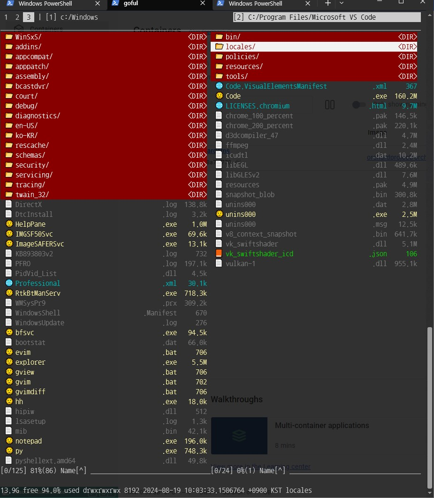

# Goful

Goful is a CUI file manager written in Go.

* Works on cross-platform such as gnome-terminal, osx and windows terminal(cmd.exe is ok but not recommended. powershell or windows terminal is better).
* Displays multiple windows and workspaces
* A command line to execute using such as bash and tmux
* Provides filtering search, async copy, glob, bulk rename, etc.

## Install

### Pre-build binaries

See [releases](https://github.com/anmitsu/goful/releases) or 'bin' folder

### Go version >= 1.16

    $ go install github.com/anmitsu/goful@latest
    ...
    $ goful

### Go version < 1.16

    $ go get github.com/anmitsu/goful
    ...
    $ goful

## Usage

| key                                  | function                                                                                  |
| ------------------------------------ | ----------------------------------------------------------------------------------------- |
| `down` `j`                           | Move cursor down                                                                          |
| `up` `k`                             | Move cursor up                                                                            |
| `home` `^` `I`                       | Move cursor top                                                                           |
| `end` `$` `U`                        | Move cursor bottom                                                                        |
| `C-i` `right` `l`                    | Move cursor right                                                                         |
| `left` `h`                           | Move cursor left                                                                          |
| `u`                                  | More move cursor down                                                                     |
| `i`                                  | More move cursor up                                                                       |
| `pgdn`                               | Page down                                                                                 |
| `pgup`                               | Page up                                                                                   |
| `backspace` `left` `h`               | Change to upper directory                                                                 |
| `C-m` = `enter` `l` `left`           | open directory or file on cursor                                                          |
| `o`                                  | open every marked directorys and files                                                    |
| `~`                                  | Change to home directory                                                                  |
| `\`                                  | Change to root directory                                                                  |
| `w`                                  | Change to neighbor directory to this one                                                  |
| `W`                                  | Change to this directory to neighbor's                                                    |
| `C-w`                                | Create directory window                                                                   |
| `M-w`                                | Close directory window                                                                    |
| `tab`                                | Move next window                                                                          |
| `C-b`                                | Move previous window                                                                      |
| `C-t`                                | Create workspace                                                                          |
| `M-t`                                | Close workspace                                                                           |
| `t`                                  | change to next tab                                                                        |
| `T`                                  | open tab menu                                                                             |
| `space`                              | Toggle mark                                                                               |
| `                                    | Invert mark                                                                               |
| `f3` `C-space`                       | preview (Mac have to change or uncheck default keyboard short cut C-Space) (Windows should install QuickLook https://github.com/QL-Win/QuickLook/releases) (Linux is not ready yet)                       |
| `C-r`  `'`                           | refresh screen                                                                            |
| `s`                                  | Sort                                                                                      |
| `v`                                  | View                                                                                      |
| `b`                                  | Bookmark                                                                                  |
| `e`                                  | open other app                                                                            |
| `x`                                  | open basic Command menu                                                                   |
| `X`                                  | open External command menu                                                                |
| `f` `/`                              | Find                                                                                      |
| `;`                                  | Shell                                                                                     |
| `:`                                  | Shell suspend                                                                             |
| `n`                                  | Make new file                                                                             |
| `r` `f2` `Xr`                        | Rename                                                                                    |
| `R`                                  | Bulk rename by regexp                                                                     |
| `c` `f5`                             | Copy to neightbor window                                                                  |
| `C`                                  | duplicate                                                                                 |
| `m` `f6` `Xm`                        | Move to neightbor window                                                                  |
| `K` `f7` `Xk`                        | Make new directory(f7 make dir by file name)                                              |
| `d` `f8`                             | Move files/folders to Recyle Bin                                                          |
| `delete`                             | Remove files/folders permanently.                                                         |
| `D`                                  | Change directory                                                                          |
| `g`                                  | Glob                                                                                      |
| `G`                                  | Glob recursive                                                                            |
| `C-[` = `esc`                        | Cancel                                                                                    |
| `q` `Q`                              | Quit                                                                                      |
| `B`                                  | go back to  previous directory                                                            |
| `F`                                  | go to forward directory                                                                   |
| `y`                                  | yank(or copy) file to clipboard                                                           |
| `p`                                  | paste yanked file to this directory (if you copy your file's PATH, you can paste it in goful too ([windows explorer: shift+rightClick+a]     [mac finder: cmd+opt+c])                                                       |
| `P`                                  | move yanked file to this directory                                                        |
| `Y`                                  | copy file(or directory) path to clipboard                                                 |
| `N`                                  | copy file(or directory) name only to clipboard                                            |
| `O`                                  | open this directory in finder, explorer...                                                |
| `a`                                  | zip marked files, dirs to neighbor dir                                                    |
| `A`                                  | zip marked files, dirs to this dir                                                        |
| `z`                                  | unzip file to neighbor dir                                                                |
| `Z`                                  | unzip file go this dir                                                                    |
https://github.com/QL-Win/QuickLook/releases
**f2, f5, f6, f7, f8 do External command(rename, copy, move, mkdir, remove)
external command is more fast and comfortable in some cases. but 'refresh screen' is needed because goful doesn't know it has been finished.
(default copy and move command shows the Progress bar, and refresh view after it. so default copy/move command is good for small size files.) 

For more see [main.go](main.go)

## Demos

### Copy and Move

Copy (default `c`, external command `f5`) and move (default `m`, `f6`) mark (default `space` and invert
`) files.

First input a copy source file name (or path).  The default source is a file
name on the cursor.  If files are marked, this step is skipped.

Second input a copy destination path and start copy processing.  The default
destination is a neighboring directory path.

During processing draws copying file count, size and name, progress percent,
gauge, bps and estimated time of arrival.

If the source file type is a directory, recursively copy.  Also copy
modification time and permissions.

Rise a override confirm dialog `[y/n/Y/N/b]` if the name same as source file
exists in the destination.  This dialog means:

* `y` is overwrite only this file
* `n` is not overwrite only this file
* `Y` is overwrite all later file
* `N` is not overwrite all later file
* `b` is make a backupfile.

Copy process works asynchronously.  And processed in the order if you run
multiple copies.

Note that copy process can not interrupt.  If you want to interrupt, please quit
the application (default `q` `Q`).

### Bulk Rename

Bulk renaming (default `R`) for mark (default `space` and invert `C-space`)
files.

Rename by the regexp pattern.  Input like the vim substituting style
(regexp/replaced).  Display and confirm matched files and replaced names before
rename.

### Finder (Filtering search)

The finder (default `f` `/`) filters files in the directory.

Input characters recognizes as the regexp.  Case insensitive when inputs
lowercase only, on the other hand case sensitive when contains uppercase.

Delete characters by `backspace` (default).  Can select input
histories by `M-p` and `M-n` (default).

Other than character inputs (exclude a space) and the finder keymap pass to the
main input.

Hit reset key (default `C-[` = `Esc`) to clear filtering.

### Glob

Glob is matched by wild card pattern in the current directory (default `g` and
recursive `G`).

Hit reset key (default`C-[` = `Esc`) to clear glob patterns.

### Layout

Directory windows position are allocated by layouts of tile, tile-top,
tile-bottom, one-row, one-column and fullscreen.

View menu (default `v`), run layout menu and select layout:

### Execute Terminal and Shell

Shell mode (default `:` and suspended `;`) runs a terminal and execute shell
such as bash and tmux.  The cmdline completion (file names and commands in
$PATH) is available (default `C-i` that means `tab`).

For example, spawns commands by bash in a gnome-terminal new tab:

The terminal immediately doesn't close when command finished because check
outputs.

If goful is running in tmux, it creates a new window and executes the command.

### Expand Macro

| macro           | expanded string                                                            |
| --------------- | -------------------------------------------------------------------------- |
| `%f` `%F`   | File name/path on cursor                                                       |
| `%x` `%X`   | File name/path without extension on cursor                                     |
| `%e`        | File extension only on cursor                                                  |
| `%m` `%M`   | Marked file names/paths joined by spaces                                       |
| `%c` `%C`   | Marked file names/paths joined by spaces + singleQuore + comma                 |
| `%d` `%D`   | Directory name/path on cursor                                                  |
| `%d2` `%D2` | Neighbor directory name/path                                                   |
| `%~f` ...   | Expand by non quote. that means every macro will be quoted by ' without ~.     |
| `%T` `%t`   | yearMonthDay, hourMinuteSecond                                                 |
| `%&`        | Flag to run command in background                                              |

The macro is useful if do not want to specify a file name when run the shell.

Macros starts with `%` are expanded surrounded by quote, and those starts with
`%~` are expanded by non quote.  The `%~` mainly uses to for cmd.exe.

Use `%&` when background execute the shell such as GUI apps launching.

<!-- demo size 120x35 -->

## Customize

Goful don't have a config file, instead you can customize by edit `main.go`.

Examples of customizing:

* Change and add keybindings
* Change terminal and shell
* Change file opener (editor, pager and more)
* Adding bookmarks
* Setting colors and looks('filer-file.go')

Recommend remain original `main.go` and copy to own `main.go` for example:

Go to source directory

    $ cd $GOPATH/src/github.com/anmitsu/goful

Copy original `main.go` to `my/goful` directory

    $ mkdir -p my/goful
    $ cp main.go my/goful
    $ cd my/goful

Install after edit `my/goful/main.go`

    $ go install

### Contributing

[Contributing Guide](.github/CONTRIBUTING.md)

## difference between https://github.com/anmitsu/goful

### add fuction

* set icon + color by extension 
* History. so you can go back to previous folder you've been
* yank and paste

### some tweaks for windows user

* quote symbol changed to ' not  ". windows have troubles using ".
* windows cmd changed to powershell.
* \ changed to /  ('c:\users\bilbo' -> c:/users/bilbo').
* 7z is main archive manager. zip, rar, tar, gz... rfiles are compressed and unzipped with 7z. 
* fastcopy(fcp) is copy manager. f5, f6 or External command use fcp. default copy or move is slower than fcp. (default copy and move command shows the Progress bar, and refresh view after it. so default copy/move command is good for small size files.) 
* recycle.exe moves files(and folders) to recycle bin for safely delete. 'delete' key removes files(and folder) permanently.
* you can use above program in 'bin' folder or download it by yourself. and place it PATH in Environment variables. if you don't know about PATH variables, just copy goful, 7z, fcp, recycle to c:\windows\system32 folder.

7z: https://www.7-zip.org/download.html

fcp : https://forest.watch.impress.co.jp/library/software/fastcopy/download_11574.html

recycle: https://github.com/Zigatronz/Windows-recycle-bin-CLI-for-CMD

